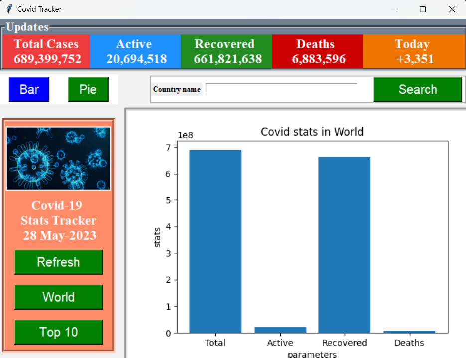
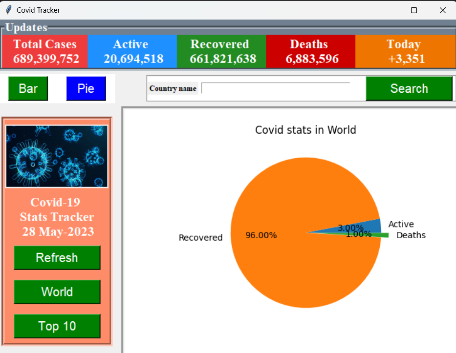
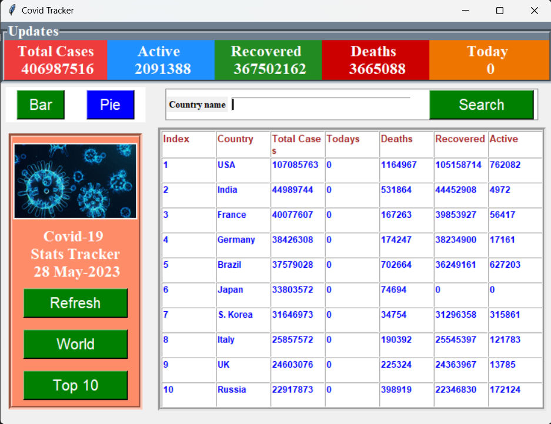

# **Covid-19 Tracker**

<p align = "center"></p>

Covid-19 Tracker is a simple python based covid cases tracking application made using the tkinter and requests library. The data is scraped from the [worldometers](https://www.worldometers.info/coronavirus/) website.

# Python Version

## Python 3

# Dependencies

- Requests
  
- Beautifulsoup

- Matplotlib

- Pandas
  
    ```
    pip install requests
    pip install beautifulsoup4
    pip install matplotlib
    pip install pandas
    ```

# Set-Up ⚒️

<p align = "center"></p>

- Ensure you have the latest stable version of [Python 3](https://www.python.org/downloads/) in your system

- Open your terminal / command prompt

- Clone the repository 
    ```
    git clone https://github.com/Julian-Idl/Covid-19-Tracker.git
    ```
- Change the directory to the cloned project
    
    ```
    cd Covid-19-Tracker
    ```

# Usage

- Run the following command in terminal / command prompt
    ```
    python application.py
    ```

# Demo 👇

**v.0.0.1 (Graphical User Interface Default Preview)**


<p align = "center"></p>


**v.0.0.1 (Graphical User Interface with Pie Chart Preview)**

<p align = "center"></p>

**v.0.0.1 (Graphical User Interface with Top 10 Countries)**

<p align = "center"></p>

# Note ✏️

- Feel free to contact me in my  [](https://julian-idl.codes)

# Author

Made with ♥ by [`Julian-Idl`](https://julian-idl.codes) 